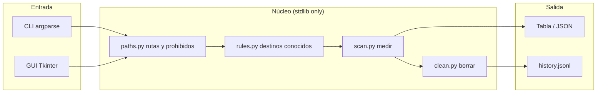
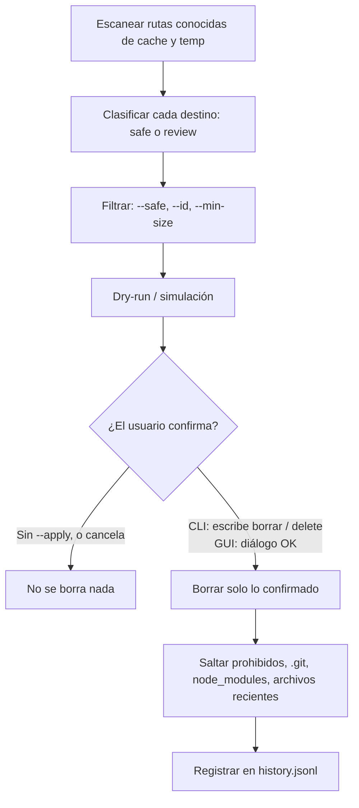
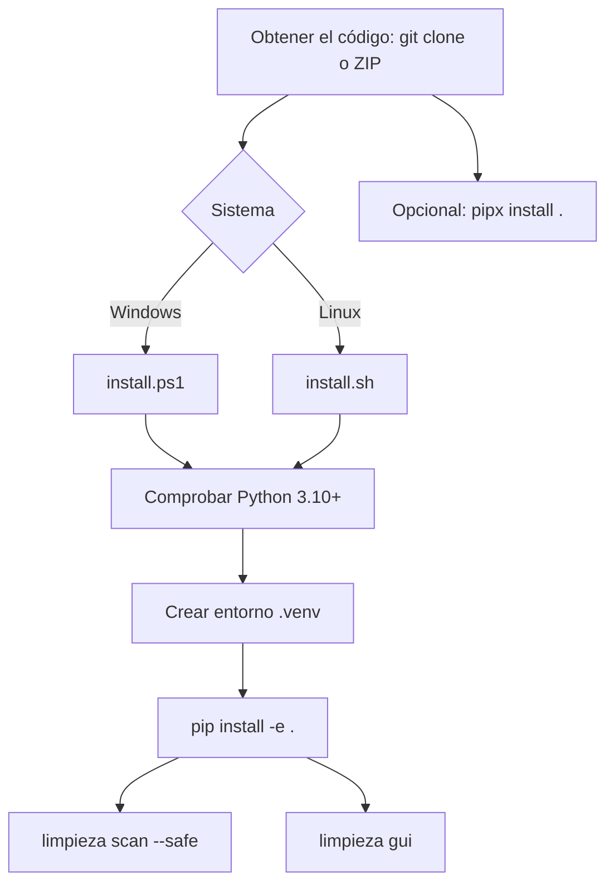

# Limpieza

Limpiador de disco **inteligente y seguro** para **Windows** y **Linux**.
Licencia MIT. Python 3.10 o superior. **Sin dependencias de terceros en tiempo de ejecución.**

Intelligent, safe disk cleaner for **Windows** and **Linux**. MIT licensed. Python 3.10+, **no third-party runtime dependencies**.

---

## Español

### Por qué usar Limpieza (y no otras formas de “limpiar”)

Windows Disk Cleanup / Liberador de espacio, CCleaner y borrar carpetas a mano (Temp, `%LOCALAPPDATA%`, `~/.cache`) se parecen en el objetivo —liberar gigas— y se diferencian en **qué** se atreven a tocar.

| Enfoque | Qué hace bien | Dónde falla |
|---|---|---|
| **Liberador de espacio de Windows** | Limpia residuos del sistema que Microsoft considera seguros | No cubre pip/npm/Gradle/uv, caches de navegador con precisión, runtimes viejos de Cursor, ni un informe previo por destino. En Linux no existe. |
| **Borrar Temp / Downloads / `.cache` a ciegas** | Rápido | Puede borrar descargas recientes, proyectos, `.git`, cookies, historial, o archivos que otra app está usando. No hay simulación ni confirmación por objetivo. |
| **“Limpiadores” agresivos** | Prometen muchos GB | A menudo mezclan publicidad, telemetría, o reglas opacas. Pueden romper software al borrar caches que tardan horas en reconstruirse (modelos ML, toolchains). |
| **Limpieza** | Escanea **rutas conocidas de cache/temp**, las **clasifica**, **simula** y **pide confirmación** antes de borrar | No formatea discos, no toca documentos ni el sistema operativo, no “optimiza” el registro. |

Ventajas concretas:

1. **Simulación por defecto.** `limpieza clean` no borra nada hasta `--apply`. Puedes ver exactamente qué se iría.
2. **Clasificación honesta.** `safe` = regenerable (temp, caches de paquetes, miniaturas). `review` = grande o lento de recuperar (modelos Hugging Face, instaladores viejos). Nunca se mezclan sin que lo elijas.
3. **Lista de prohibidos.** No opera sobre Documentos, Escritorio, Imágenes, Vídeos, Música, OneDrive, la carpeta de usuario, ni raíces del SO (`C:\Windows`, `/usr`, `/etc`, …).
4. **No camina proyectos.** Omite `.git` y `node_modules` aunque aparezcan bajo una ruta de cache.
5. **Temp con edad mínima.** En temporales, ignora archivos de las últimas 24 horas (72 h y solo tuyos en `/tmp` de Linux).
6. **Navegador = solo cache.** Cookies, sesión e historial se quedan.
7. **Confirmación explícita.** En CLI hay que escribir `borrar` / `delete`. En la GUI hay un diálogo. `--yes` existe para scripts, no es el modo por defecto.
8. **Historial JSONL** de borrados reales (auditoría local).
9. **Una herramienta, dos sistemas.** Mismas reglas de seguridad en Windows y Linux, CLI y GUI, **cero paquetes pip de runtime**.
10. **Código abierto y local.** No hay cuenta, nube ni telemetría. Tú ves las reglas en `src/limpieza/rules.py`.

Limpieza **no** es un formateador, **no** desinstala programas, **no** limpia el registro de Windows y **no** toca Docker/WSL/juegos a propósito.

### Arquitectura



### Tubería de seguridad: escanear → clasificar → simular → confirmar → borrar



Nada se elimina en el paso de escaneo. El borrado es un comando distinto (`clean --apply` o el botón de la GUI con “solo simular” desmarcado).

### Instalación (cualquier persona, Windows o Linux)

Requisitos: **Python 3.10+**. No hace falta Node, Docker ni paquetes pip extra para usar la app.



**Windows** (PowerShell, en la carpeta del proyecto):

```powershell
powershell -ExecutionPolicy Bypass -File .\install.ps1
.\.venv\Scripts\limpieza.exe scan --safe
.\.venv\Scripts\limpieza.exe gui
.\.venv\Scripts\python.exe -m limpieza scan --safe
```

Si no tienes Git, descarga el ZIP del repositorio, descomprímelo y ejecuta `install.ps1` dentro de esa carpeta.

**Linux**:

```bash
chmod +x install.sh
./install.sh
.venv/bin/limpieza scan --safe
.venv/bin/limpieza gui
.venv/bin/python -m limpieza scan --safe
```

En Debian/Ubuntu, la GUI necesita Tk:

```bash
sudo apt install python3 python3-venv python3-tk
```

**pipx** (instalación aislada, opcional):

```bash
pipx install .
limpieza scan --safe
limpieza gui
```

**Manual** (si ya tienes un venv):

```bash
python -m pip install -e .
python -m limpieza scan --safe
```

Las dependencias de runtime están **vacías**. `pytest` solo se instala con `pip install -e ".[dev]"` si vas a correr tests.

### CLI

El comando por defecto es `scan` si no pasas subcomando.

| Comando | Qué hace |
|---|---|
| `limpieza` / `limpieza scan` | Lista destinos y tamaños. No borra. |
| `limpieza clean` | Simula un borrado (dry-run). |
| `limpieza clean --apply` | Borra de verdad tras escribir `borrar` o `delete`. |
| `limpieza gui` | Abre la interfaz gráfica. |
| `python -m limpieza …` | Igual, sin depender del script `limpieza` en PATH. |

### Flags

| Flag | Dónde | Significado |
|---|---|---|
| `--lang es` / `--lang en` | global | Idioma. Si omites, se detecta el locale. |
| `--version` | global | Versión. |
| `--safe` | scan, clean | Solo destinos **safe** (regenerables). |
| `--id pip-cache,npm-cache` | scan, clean | Solo esos ids de regla (coma). |
| `--min-size 50` | scan, clean | Oculta destinos menores de N megabytes. |
| `--json` | scan | Salida JSON (ids, bytes, samples). |
| `--apply` | clean | Ejecuta el borrado. Sin esto, solo simula. |
| `-y` / `--yes` | clean | No pide escribir `borrar`/`delete` (sigue haciendo falta `--apply`). |

### Ejemplos

```bash
# Ver qué hay (seguro primero)
limpieza scan --safe
limpieza scan --lang es --min-size 10

# Informe máquina
limpieza scan --json

# Simular limpieza segura
limpieza clean --safe

# Borrar caches de Python y npm, con confirmación
limpieza clean --id pip-cache,npm-cache --apply

# Scripts / CI local: sin prompt (tú eres responsable)
limpieza clean --safe --apply --yes

# Interfaz
limpieza gui --lang es
python -m limpieza gui
```

### GUI

- Arranca con **solo objetivos seguros** y **solo simular** marcados.
- Doble clic o Espacio para incluir/excluir una fila (`[x]` / `[ ]`).
- “Limpiar selección” en modo simulación no borra; desmarca “Solo simular” y confirma el diálogo para borrar.
- El registro inferior muestra el progreso.

### Niveles de seguridad

| Nivel | Ejemplos | ¿En `--safe` y GUI por defecto? |
|---|---|---|
| **safe** | Temp (>24 h), pip/npm/pnpm/yarn/Gradle/uv, cache NVIDIA OTA, caches de navegador, miniaturas, runtimes viejos de Cursor (deja el más nuevo) | Sí |
| **review** | Paquetes NuGet, cache de Cargo, modelos Hugging Face, instaladores en Descargas de más de 30 días | No |

### Lo que nunca se borra

Limpieza **rechaza** operar sobre:

- La carpeta de usuario (`HOME`)
- Documentos / Documentos, Escritorio, Imágenes, Vídeos, Música
- OneDrive
- `C:\Windows`, `C:\Program Files` (y x86), `/`, `/usr`, `/bin`, `/etc`, `/boot`, `/opt`, `/root`, `/home` como raíz
- Directorios llamados `.git`, `.svn`, `.hg`, `node_modules` al caminar
- Cookies e historial del navegador (solo subcarpetas de cache)
- El runtime **más reciente** del agente de Cursor
- Archivos más nuevos que el umbral de edad de la regla (24 h en temp de usuario; 3 días en `/tmp`; 30 días en instaladores)

**Fuera de alcance a propósito:** imágenes Docker, distros WSL, `state.vscdb` de Cursor, juegos, archivos de OneDrive, documentos.

El historial de borrados reales se guarda en:

- Windows: `%LOCALAPPDATA%\limpieza\history.jsonl`
- Linux: `~/.local/state/limpieza/history.jsonl`
- O la ruta de `LIMPIEZA_STATE_DIR` si está definida

### Desarrollo y tests

```bash
python -m pip install -e ".[dev]"
python -m pytest
```

```
src/limpieza/   biblioteca + CLI + GUI
tests/          pytest
install.ps1     instalador Windows
install.sh      instalador Linux
```

### Licencia

MIT. Ver [LICENSE](LICENSE). Copyright (c) 2026 limpieza contributors.

---

## English

### Why this tool (vs Disk Cleanup, wiping folders, “cleaners”)

Disk Cleanup, CCleaner-style apps, and deleting `Temp` / `~/.cache` by hand all try to free space. They differ in **what they are willing to destroy**.

| Approach | Strength | Failure mode |
|---|---|---|
| **Windows Disk Cleanup** | OS-approved system leftovers | Misses language/tool caches (pip, npm, Gradle, uv), precise browser-cache-only cleanup, old Cursor agent runtimes, and a per-target preview. Not on Linux. |
| **Blindly deleting Temp / Downloads / `.cache`** | Fast | Can wipe recent downloads, project files, `.git`, cookies, or files in use. No dry-run, no per-target confirm. |
| **Aggressive “PC cleaners”** | Big GB claims | Opaque rules, sometimes ads/telemetry. May delete caches that take hours to rebuild (ML models, toolchains). |
| **Limpieza** | Scans **known cache/temp paths**, **classifies**, **dry-runs**, **confirms**, then deletes | Does not format disks, touch documents, or “optimize” the registry. |

What you get:

1. **Dry-run by default** — nothing is deleted until `--apply`.
2. **Honest classes** — `safe` (regenerable) vs `review` (large / slow to restore).
3. **Hard denylist** — Documents, Desktop, Pictures, Videos, Music, OneDrive, home, OS roots.
4. **Skips `.git` and `node_modules`** while walking.
5. **Age gates** on temp (24h) and `/tmp` (72h, your files only).
6. **Browser = cache only** (cookies/history stay).
7. **Typed confirmation** (`delete` / `borrar`) or a GUI dialog.
8. **Local JSONL history** of real deletions.
9. **Windows + Linux**, CLI + GUI, **zero runtime PyPI deps**.
10. **Open and local** — no account, no cloud, rules are in source.

Limpieza does **not** format drives, uninstall apps, clean the Windows registry, or target Docker/WSL/games.

### Architecture

Same diagram as above: CLI/GUI → path guards → builtin rules → scan/measure → table/JSON or delete + `history.jsonl`. Stdlib only.

### Safety pipeline

Scan known paths → classify `safe`/`review` → optional filters → **dry-run** → explicit confirm → delete confirmed targets only → append history. Scan never deletes.

### Install (any person on Windows or Linux)

Need **Python 3.10+** only.

**Windows** (PowerShell, project folder):

```powershell
powershell -ExecutionPolicy Bypass -File .\install.ps1
.\.venv\Scripts\limpieza.exe scan --safe
.\.venv\Scripts\limpieza.exe gui
.\.venv\Scripts\python.exe -m limpieza scan --safe
```

No Git? Download the repo ZIP, extract, run `install.ps1`.

**Linux**:

```bash
chmod +x install.sh
./install.sh
.venv/bin/limpieza scan --safe
.venv/bin/limpieza gui
.venv/bin/python -m limpieza scan --safe
```

Debian/Ubuntu GUI: `sudo apt install python3 python3-venv python3-tk`.

**pipx** (optional): `pipx install .` then `limpieza scan --safe`.

**Manual:** `python -m pip install -e .` then `python -m limpieza scan --safe`.

Runtime `dependencies` in `pyproject.toml` are empty. Dev only: `pip install -e ".[dev]"` for pytest.

### CLI, flags, GUI, safety, never-deleted

See the Spanish tables above — same flags and behavior. Confirmation word is `delete` when `--lang en` (or a non-Spanish locale) and `borrar` when `--lang es`.

Default GUI: safe-only + dry-run checked. Double-click/Space toggles inclusion.

### License

MIT. See [LICENSE](LICENSE).
